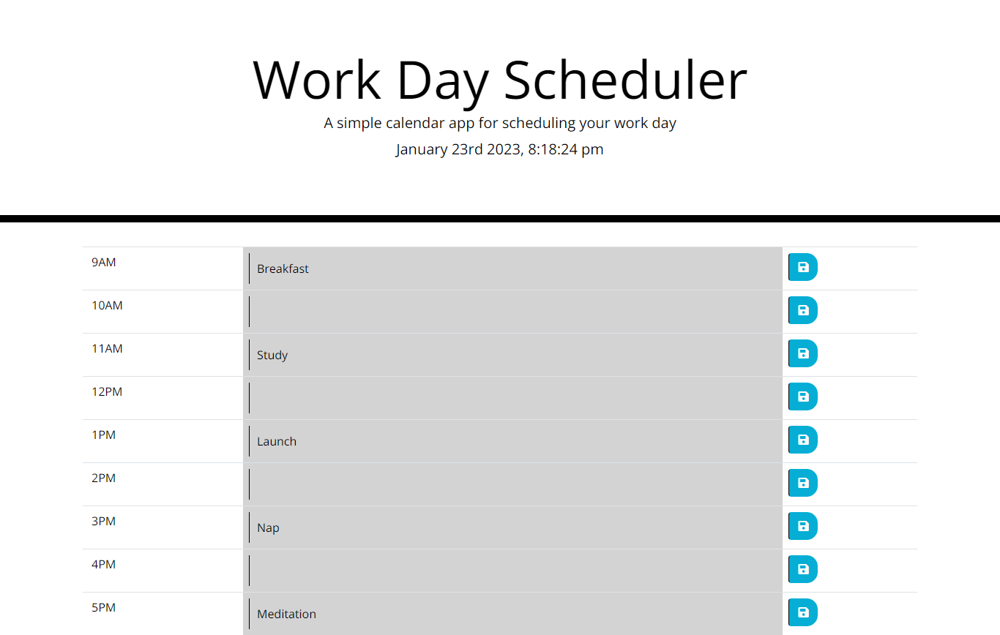

# Daily Planner

## Description
This is a Event schedule app.App show the working hours in which user can save his/her events.Here is the deployed website link [Daily Planner](https://haroon-dev13.github.io/daily-planner/)

## Installation
To use this Website you do not need to install any software or tool.You just need a browser and internet connection to visit this website.

## Usage
This is a Event schedule web application.It shows some working hours on page.It allows user to save the evets according to hours.Color-code of each timeblock based on past, present, and future is developed.
Given below is the screen short of example output.

* ### Daily Planner Output:

## Credits
N/A

## License
Copyright (c) 2023 Haroon-Dev
